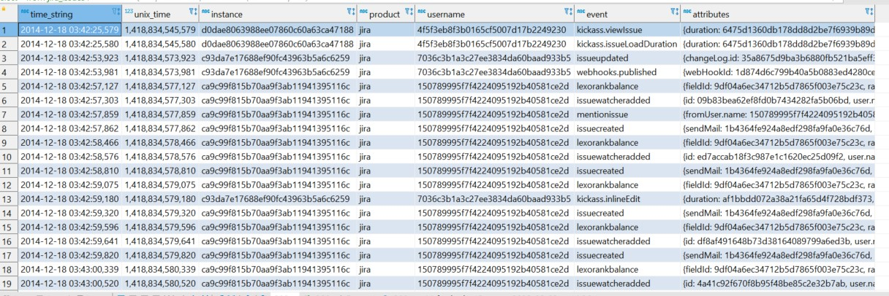
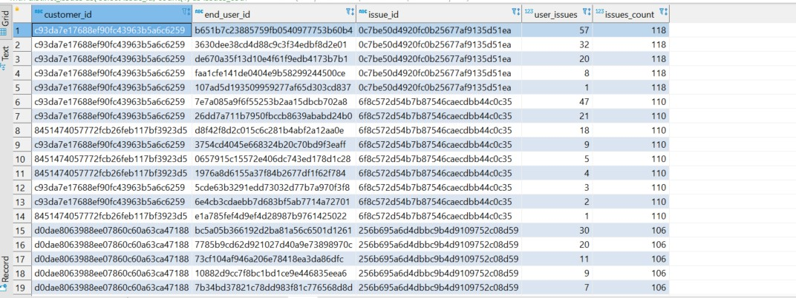
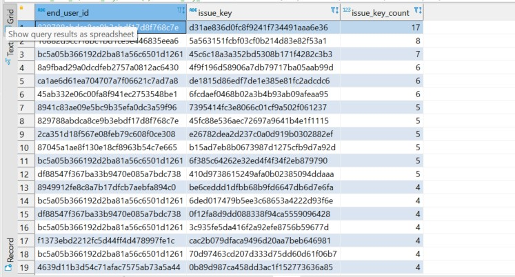
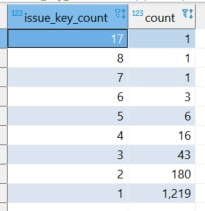
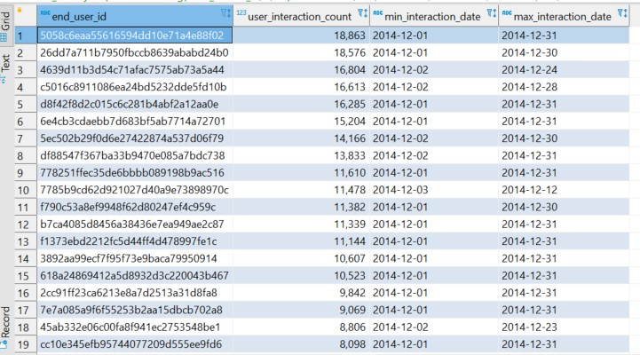

# AtlassianCodeChallenge
Atlassian Code Challenge response.

This read me guide will help you to best use the code file, steps required to run the code file and prerequisite required to be installed on your machine to run the code.

## Prerequisites and setting up required infrastructure

The answers for all the questions are covered in **_code.sql file_**. However, to run code.sql, we would need following tools available in your computer.

- Docker desktop
- jira_clean.tsv file (I have received this file as part of assignment email.)
- DBeaver

We can download PostgreSQL locally and run it. In that case we do not need Docker desktop, but PostgreSQL latest version.

Assuming that we are going ahead with Docker approach, once the Docker desktop is running, 
run the following command to create PostgreSQL container.

```shell
docker run -d \
	--name some-mypostgredb \
	-e POSTGRES_PASSWORD=test123 \
	-e PGDATA=/var/lib/postgresql/data/pgdata \
	-p 5432:5432 -p 8080:8080 \
	-v "C:\\Users\\Parth\\PycharmProjects":/shared_folder \
	postgres
```
**_Please note that_** in the above command, you need to replace the value after -v argument before colon (:). 
If you are using Linux/Mac, you may skip the double quotes ("). 

The path before colon (:) will be path from your local 
computer, and it should contain the jira_clean.tsv. 

This file then will be available inside the PostgreSQL 
container. The path then will be referred in the code.sql file.

In my case, jira_clean.tsv is available at **"C:\\\Users\\\MyUser\\\PycharmProjects\\\jira_clean.tsv"**. Therefore, inside the 
container it will be available as **/shared_folder/jira_clean.tsv**

If you prefer not to use Dockerized version of PostgreSQL, then download the latest version of PostgreSQL and install it.
 PostgreSQL will create the default database called postgres. 

While installation, you would have set up the root username and password. Keep a note of that.

Either dockerized version or local install, PostgreSQL will have following configs. 
```properties
database: postgres
username: postgres
password: test123
host: localhost
port: 5432
```
Use the above information in DBeaver to connect to the newly available database.

Please note that if you change in any of the above properties, use the changed value while establishing the connection.

### Run the code

Once the connection is established, use the code.sql and run those queries one by one and read the inline comments to
go through my approach.

## Output of few required queries.
At the end of the section 1, we would have populated the jira_issues source table. The output looks like below.



The output of Query1 looks like below:



The output of Query2 looks like below:



The output of Query2 further analysis looks like below:



The output of Query3 looks like below:



## Output table schema documentation

|Column Name | Column Description | Derived From | Derivation logic | Comments |
| --- | ----------- | ----| ---| ---- |
| issue_viewed_at | Date and time when user interacted with platform |jira_issues.time_string | direct mapping | - |
| customer_id | Unique identifier for customer | jira_issues.instance | direct mapping | - |
| end_user_id | Unique identifier of customer's end users | jira_issues.username | direct mapping | - |
| user_action | Type of action user performs on product | jira_issues.event | direct mapping | - |
| issue_key | unique issue_key | jira_issues.attributes | Retrieved using regex from attributes column | This field is extracted to see whether users see same issue or distinct issue |
| issue_id | issue_id | jira_issues.event | Retrieved using regex from attributes column | This field is extracted to see users see which issues most |

## Comments regarding scaling and making it more robust

The following section will illustrate how can **we scale this ETL effectively**. 

There are several architectures that can be utilised to scale this pipeline if we receive 10x more data. 
One of the approaches that I like is to use Databricks notebooks and create datalake architecture.

The benefit of this approach is whatever SQL we have written can easily be reused. For 
compute we will use spark cluster that can be horizontally scaled using appropriate configuration.

The storage for datalake can be any cloud storage and that is usually very cheaper. 
Therefore, with 10x scale storage cost would be minimal.

Spark as processing framework can be set up in such a way that it will cost us only when Spark Jobs are running.
This in turn will help in reducing the processing cost, and we can scale not only 10x but even 100x.

The following section will illustrate how can we make it more **robust**.

If the source data is not refreshed, we need some mechanism so that data does not get duplicated in target table.
In my code for stored procedure based ETL, I have defined that it would require two dates start_date and end_date.
If they are same it will process same one day's data and if it is different it will process multiple day's data.

There can be pre-processing steps before data is extracted from jira_issues table. This is to verify whether data is valid or invalid.
Invalid data can be ignored based on the defined rules.

The ETL can also check in target table what is max date and time for which data is available, 
and it can pull data from source table which is beyond that date and time. 
This way we can even avoid further manual intervention. 